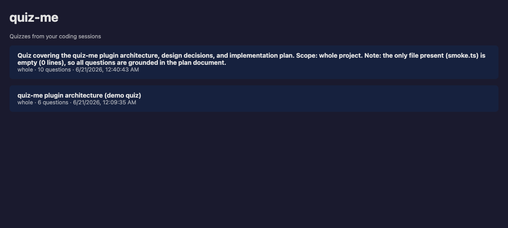
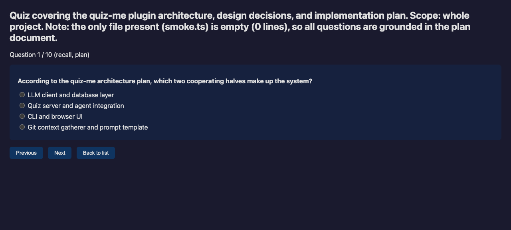
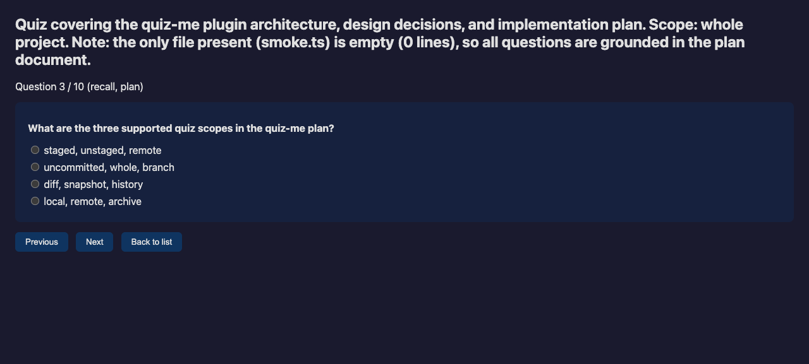
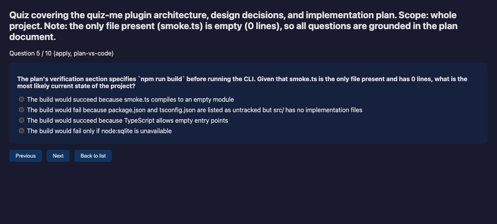
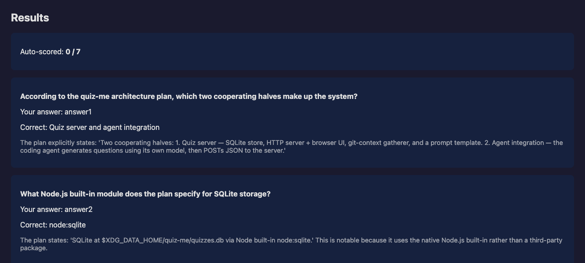

# quiz-me

Context-aware quiz plugin for coding agents (Oh My Pi, Claude Code, Codex). Generates quizzes testing your understanding of the current task/code using the host agent's own model — no separate API key.

## Features

- **Three scope modes**: uncommitted changes, whole project, or diff against a branch
- **Varying difficulty**: recall, apply, analyze questions
- **Question kinds**: code comprehension, plan-vs-code alignment, design reasoning
- **SQLite persistence**: quizzes and attempts saved locally
- **Browser UI**: local HTTP server at `http://127.0.0.1:<port>`
- **Auto-hook**: fires after code review turns (like Plannotator for plans)
- **Manual command**: `/quiz-me` on demand

## Install

```bash
npm install -g .
# or from repo:
npm install && npm run build
```

## Usage

```bash
# Start server (idempotent)
quiz-me serve

# Generate quiz prompt (agent reads this and POSTs JSON back)
quiz-me generate --scope uncommitted --difficulty mix
quiz-me generate --scope whole
quiz-me generate --scope branch --branch main

# Check status / list quizzes
quiz-me status
quiz-me list
```

## Platform adapters

```bash
quiz-me install --platform oh-my-pi
quiz-me install --platform claude-code
quiz-me install --platform codex
```

## Architecture

The agent generates quiz JSON using its own model; the server persists, serves, and grades. See `docs/quiz-me-plugin-plan.md` for full design.

## How it uses your Claude/Codex subscription (no API key)

quiz-me **never calls an LLM directly**. The flow is:

1. `quiz-me generate --scope whole` prints a **prompt template** to stdout
2. The prompt tells the agent: "Output ONLY a JSON quiz object matching this schema"
3. The **agent's own model** (Claude, Codex, etc.) generates the quiz JSON
4. The agent POSTs the JSON to `http://127.0.0.1:<port>/api/quizzes`
5. The server persists to SQLite and opens the browser UI

There are **zero** OpenAI/Anthropic SDK calls in the quiz-me source — no API key needed.

```bash
node dist/src/cli.js generate --scope whole --difficulty mix
# Agent reads stdout prompt → generates JSON → POSTs to printed URL
```

## Prompt (what the agent receives)

The prompt (`src/prompt.ts` → `buildPrompt()`) includes:

- **JSON schema** — exact shape: `{summary, questions[{difficulty, kind, type, prompt, options, answer, explanation, codeRef}]}`
- **Rules** — MC (4 options), true/false (`"true"|"false"`), short-answer; difficulty counts (3 recall, 5 apply, 2 analyze); kind distribution
- **Context sections**:
  - `## Plan` — contents of `docs/plan.md` (or `PLAN.md`, `plan.md`, etc.)
  - `## Diff` — unified diff from git (scope-dependent)
  - `## Files` — file paths + line counts

Full docs: [docs/prompt-and-subscription.md](docs/prompt-and-subscription.md)

## Screenshots (real quiz generated by Claude)

These screenshots were captured from a real quiz about the quiz-me repo itself, generated by **Claude Sonnet 4** (using its own Anthropic subscription, no proxy) by feeding it the prompt from `quiz-me generate --scope whole --difficulty mix`.

| View | Screenshot |
|------|------------|
| Quiz list |  |
| Multiple choice (Q1: architecture) |  |
| True/false (Q3) |  |
| Short answer (Q5) |  |
| Results (auto-scored) |  |

Re-create them (with Claude directly, bypassing cliproxy):
```bash
# Start server
quiz-me serve

# Generate prompt
quiz-me generate --scope whole --difficulty mix > /tmp/prompt.txt
sed '$d' /tmp/prompt.txt > /tmp/prompt-only.txt  # strip POST instruction

# Have Claude generate the quiz (uses its own auth — no proxy)
env -u ANTHROPIC_BASE_URL -u ANTHROPIC_AUTH_TOKEN \
  claude -p "$(cat /tmp/prompt-only.txt)" --print > /tmp/claude-output.txt

# Extract JSON from ```json block
QUIZ_JSON=$(sed -n '/^```json/,/^```/p' /tmp/claude-output.txt | sed '1d;$d')

# POST to server
curl -X POST http://127.0.0.1:4317/api/quizzes?scope=whole \
  -H "Content-Type: application/json" -d "$QUIZ_JSON"

# Open browser
open http://127.0.0.1:4317/
```

Seed the demo quiz: `./scripts/seed-demo.sh 4317` then open `http://127.0.0.1:4317/`.
